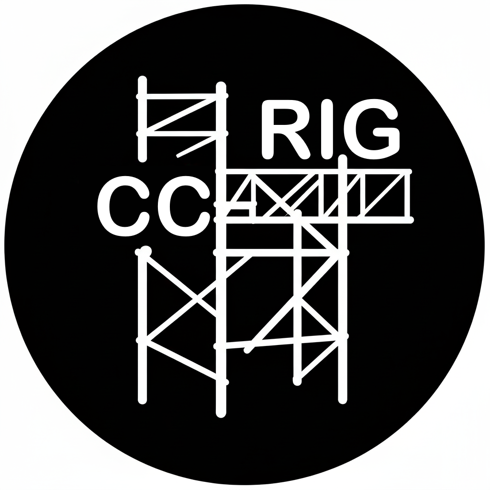

<p align="center">
  
</p>

<h3 align="center">Set up Claude Code the right way - in under a minute.</h3>

<p align="center">
  <a href="#getting-started">Getting Started</a> ·
  <a href="#what-gets-generated">What Gets Generated</a> ·
  <a href="#define-your-stack-and-process">Stack & Process</a> ·
  <a href="#for-teams">For Teams</a> ·
  <a href="#faq">FAQ</a>
</p>

<p align="center">
  
  
  
</p>

---

A properly configured Claude Code project needs `CLAUDE.md`, hooks, agents, slash commands, skills, permissions, MCP servers and memory files. Each has specific formats, frontmatter and cross-references. That takes hours of manual work and most people skip it.

**cc-rig generates all of it.** Tell it what you're building and how you like to work. It writes 30-65 native Claude Code files tuned to your framework. No runtime dependency. No lock-in. Just files that Claude Code reads on startup.

```
$ cc-rig init

  ╔══════════════════════════════════════╗
  ║           c c - r i g                ║
  ║      AI coding agent setup           ║
  ╚══════════════════════════════════════╝

  Template:    Next.js (TypeScript)
  Workflow:    Standard

  ✓ CLAUDE.md              ✓ .claude/agents/
  ✓ CLAUDE.local.md        ✓ .claude/commands/
  ✓ .claude/settings.json  ✓ .claude/skills/
  ✓ .mcp.json              ✓ agent_docs/
  ✓ memory/

  Done. Run `claude` and go.
```

---

## Install

```bash
pip install cc-rig
```

- Python 3.9+. Zero external dependencies. Standard library only.
- Optional: `pip install cc-rig[rich]` for full-screen TUI wizard (arrow keys, radio buttons, checkboxes), colors, tables and progress bars. Auto-detected, falls back to stdlib ANSI if not installed.
- Works best with Claude Code v2.1.50+. Older versions or missing installs get a warning, but cc-rig generates everything anyway.

---

## Getting Started

### Start a new project

The interactive wizard walks you through it. With Textual installed, you get a full-screen TUI with arrow-key navigation, radio buttons and checkboxes. Without it, you get numbered CLI prompts.

```bash
cc-rig init
```

Or skip the wizard and specify everything directly:

```bash
cc-rig init --template fastapi --workflow standard --name my-api
```

### Set up an existing project

Already have a codebase? cc-rig detects your stack from `package.json`, `go.mod`, `Cargo.toml`, `pyproject.toml` and more. It proposes what to add and won't touch existing files.

```bash
cd my-existing-project
cc-rig init --migrate
```

### Use a team config

A teammate already set up cc-rig? Load their config and get the same setup:

```bash
cc-rig init --config .cc-rig.json
```

### Quick picker

Don't want the full wizard? Pick from numbered lists:

```bash
cc-rig init --quick
```

---

## What Gets Generated

cc-rig generates **native Claude Code files**, the same formats from the [official docs](https://docs.anthropic.com/en/docs/claude-code). Nothing proprietary. Delete cc-rig tomorrow and everything keeps working.

```
your-project/
├── CLAUDE.md                       # Project rules Claude follows
├── CLAUDE.local.md                 # Personal preferences (not git-tracked)
├── .mcp.json                       # MCP server integrations
├── .claude/
│   ├── settings.json               # Permissions, hooks, safety guards
│   ├── agents/                     # Specialized agents for different tasks
│   ├── commands/                   # Slash commands you trigger with /
│   ├── hooks/                      # Auto-format, lint, safety blocks
│   └── skills/                     # Auto-invoked behaviors (TDD, debugging)
├── agent_docs/                     # Framework-specific guides for Claude
├── docs/                           # Recommended skills and plugins
└── memory/                         # Git-tracked team knowledge across sessions
```

Everything is tracked in a manifest, so `cc-rig clean` removes exactly what was generated. Nothing more.

### CLAUDE.md

Targets under 100 lines. Static content first, dynamic content last. Claude Code's prompt cache is prefix-matched, so every wasted token costs money on every API call.

Includes project identity, stack, tool commands, guardrails, framework-specific rules and `@import` references to deeper docs (auto-loaded by Claude Code). Not a wall of text. A tight brief that Claude actually reads.

A companion `CLAUDE.local.md` is generated for personal preferences (not git-tracked). Use it for per-developer customization without affecting the shared config.

### Agents

Isolated Claude instances in `.claude/agents/`, each with its own system prompt, model assignment and tool restrictions in YAML frontmatter.

| Agent | Role | Model |
|-------|------|-------|
| `code-reviewer` | 6-aspect code review (readability, correctness, performance, security, patterns, edge cases) | Sonnet |
| `architect` | System design, architectural decisions, ADRs | Opus* |
| `test-writer` | Test generation with coverage awareness | Sonnet |
| `explorer` | Fast codebase scanning and context gathering | Haiku |
| `refactorer` | Safe refactoring with test verification | Sonnet |
| `pr-reviewer` | Pull request review | Opus* |
| `security-auditor` | OWASP-aware security review | Opus* |
| `implementer` | Feature implementation from specs | Sonnet |
| `doc-writer` | Documentation generation | Sonnet |
| `pm-spec` | Specification creation from requirements | Opus* |
| `techdebt-hunter` | Technical debt identification | Sonnet |
| `db-reader` | Database schema and query analysis | Sonnet |
| `parallel-worker` | Background work in isolated git worktrees | Sonnet |

*\*Opus on Max/Enterprise plans, Sonnet on Pro/Team. Model switching happens via agents (never mid-conversation) to preserve prompt cache.*

Your workflow preset determines which agents are included, from 3 for quick prototyping to 13 for full production rigor.

### Slash Commands

Workflows you trigger with `/` in Claude Code. Each is a markdown file in `.claude/commands/`.

| Command | What It Does |
|---------|-------------|
| `/fix-issue` | Reproduce → diagnose → fix → test → commit |
| `/plan` | Architecture-first planning with checkpoints |
| `/research` | Explore codebase before implementing changes |
| `/review` | Multi-dimensional code review via agent |
| `/test` | Generate tests with coverage awareness |
| `/assumptions` | Surface Claude's hidden assumptions (with confidence levels) |
| `/remember` | Save learnings to persistent memory |
| `/learn` | Extract patterns from code for future sessions |
| `/refactor` | Safe refactoring with test verification |
| `/optimize` | Performance analysis and optimization |
| `/techdebt` | Identify and address technical debt |
| `/spec-create` | Create implementation spec from requirements |
| `/spec-execute` | Execute a spec with built-in validation |
| `/daily-plan` | Morning planning from active tasks |
| `/worktree` | Spawn a parallel worker in an isolated git worktree |
| `/gtd-capture` | Capture tasks into GTD inbox |
| `/gtd-process` | Process and prioritize captured tasks |
| `/security` | Security review via auditor agent |
| `/document` | Generate documentation |

Up to 19 commands depending on your workflow preset.

### Hooks

Shell scripts on Claude Code lifecycle events, configured in `settings.json`.

| Event | What Fires | Why |
|-------|-----------|-----|
| **PostToolUse** (Write) | Auto-format (prettier/ruff/gofmt) | Instant cleanup, <1s |
| **PreToolUse** (Bash) | Lint + typecheck on git commit | Quality gate before commits |
| **PreToolUse** (Write/Bash) | Block `rm -rf /`, pushes to main, `.env` writes | Safety guards |
| **Stop** | Save learnings to memory, run tests | Preserve context before session ends |
| **PreCompact** | Save context before compaction | Survive context loss |
| **SessionStart** | Load project context and active tasks | Continuity |

Up to 14 hooks depending on your workflow preset.

### Skills

Auto-invoked behaviors in `.claude/skills/`. Claude loads them when the task matches. No manual trigger needed. Three tiers:

**Tier 1 - Bundled** (cc-rig generates project-customized content):
- **TDD** - test-driven development patterns for your specific framework and test runner
- **Systematic debugging** - language-specific debugging workflow for your stack

**Tier 2 - Recommended** (cc-rig documents install commands, doesn't bundle):
- Each template preset defines framework-specific skills across 7 SDLC phases (coding, testing, review, security, database, devops, planning)
- 9 curated sources: anthropics/skills, obra/superpowers, trailofbits/skills, vercel-labs, planetscale, supabase, akin-ozer/cc-devops-skills, agamm/claude-code-owasp, wshobson/agents
- Workflow presets control which phases are active and which cross-cutting skill packs (anthropics/skills, obra/superpowers, trailofbits core, OWASP) to merge in
- Smart defaults engine merges template + workflow skills, filters by active phases, deduplicates
- Install commands rendered in CLAUDE.md; full catalog in `docs/recommended-skills.md`

**Tier 3 - Stubs** (cc-rig generates templates, you fill in):
- **Project patterns** - your team's naming conventions, architecture patterns and code organization
- **Deployment checklist** - your pre-deploy checks, deploy steps and post-deploy verification

Why only 2 bundled? Skills like OWASP security already exist as well-maintained community skills. Installing them beats copying stale versions.

### Memory

Two complementary memory systems:

- **Auto-memory** (`~/.claude/projects/`) — personal, per-machine notes managed automatically by Claude Code. Always on. Use for personal preferences and local context.
- **Team memory** (`memory/`) — git-tracked shared knowledge that travels with the repo. Use for decisions, patterns, gotchas and conventions that every contributor should know.

cc-rig generates the team memory layer:

| File | Purpose |
|------|---------|
| `decisions.md` | Architectural decisions with rationale |
| `patterns.md` | Discovered code patterns and conventions |
| `gotchas.md` | Known issues, things that didn't work |
| `people.md` | Team ownership and responsibilities |
| `session-log.md` | Brief per-session progress log |

A `Stop` hook prompts Claude to save team-relevant learnings before ending. A `PreCompact` hook does the same before context compaction wipes working memory. The `/remember` command routes personal notes to auto-memory and team knowledge to `memory/` files.

Team memory files are **not** baked into CLAUDE.md. They load via Read tool on demand. This keeps the cached prompt prefix stable across sessions.

### Permissions & Safety

`settings.json` with sensible defaults:

```json
{
  "permissions": {
    "allow": [
      "Read", "Glob", "Grep", "Edit", "Write",
      "NotebookEdit", "Bash", "WebSearch", "WebFetch", "Task"
    ],
    "deny": [
      "Bash(rm -rf /)",
      "Bash(rm -rf ~)"
    ]
  }
}
```

Safety hooks handle the rest by blocking `.env` edits, pushes to main and destructive `rm` commands with `exit 2`.

### MCP Servers

`.mcp.json` at the project root, configured for your stack. Available integrations:

**Auto-configured** (selected by template): GitHub · PostgreSQL · Playwright

**Available** (add via expert mode): Slack · Linear · Sentry · Filesystem

### Agent Docs

Framework-specific reference in `agent_docs/`. Real content, not placeholder text:

- **architecture.md** - e.g., Next.js App Router with RSC/Client component boundaries
- **conventions.md** - naming, file structure, import ordering and error handling
- **testing.md** - test strategy, fixtures, mocking and coverage expectations
- **deployment.md** - deployment workflow and infrastructure patterns for your stack
- **cache-friendly-workflow.md** - practices for maximizing prompt cache hit rates

CLAUDE.md references these via `@import` syntax, so Claude Code auto-loads them without Read tool calls. They're still outside the cached prefix to keep token costs low.

---

## Define Your Stack and Process

cc-rig separates **what you're building** (template) from **how you like to work** (workflow). Pick each independently. Any combination works.

### What you're building: Templates

Templates set your language, framework, tool commands, linting and framework-specific rules:

| Template | Stack | Highlights |
|----------|-------|-----------|
| `fastapi` | Python + FastAPI | Async patterns, Pydantic, pytest, ruff |
| `django` | Python + Django | Fat models, ORM patterns, manage.py test |
| `flask` | Python + Flask | Blueprints, extensions, pytest, ruff |
| `nextjs` | TypeScript + Next.js | App Router, RSC patterns, Tailwind |
| `gin` | Go + Gin | Handler→Service→Repository, golangci-lint |
| `echo` | Go + Echo | Echo conventions, go test |
| `rust-cli` | Rust + Clap | CLI patterns, cargo test, clippy |

### How you like to work: Workflows

| Workflow | Best for |
|----------|----------|
| **speedrun** | Side projects, prototypes, hacking. 3 agents, 6 commands, 6 hooks. No memory. Just code fast. |
| **standard** | Most projects. 5 agents, 9 commands, 10 hooks. Memory, safety hooks, code review, architecture. |
| **spec-driven** | Teams that plan first. 9 agents, 13 commands, 11 hooks. Spec create/execute, PM and implementer agents. |
| **gtd-lite** | Task-oriented developers. 8 agents, 13 commands, 11 hooks. GTD capture/process, daily planning. |
| **verify-heavy** | Production systems. 13 agents, 19 commands, 14 hooks. Security auditor, PR reviewer, every quality gate. |

### Add-ons

Some workflows include compound features that span multiple Claude Code primitives:

**Spec Workflow** (spec-driven, verify-heavy). Plan-first development: `/spec-create` and `/spec-execute` commands, `pm-spec` and `implementer` agents, `specs/TEMPLATE.md` starter file. Based on [Pimzino's spec workflow](https://github.com/Pimzino/claude-code-spec-workflow).

**GTD System** (gtd-lite). Getting Things Done for Claude Code: `/gtd-capture`, `/gtd-process`, `/daily-plan` commands, pre-created `tasks/inbox.md`, `tasks/todo.md` and `tasks/someday.md`. Based on [adagradschool's cc-gtd](https://github.com/adagradschool/cc-gtd).

**Worktrees** (spec-driven, gtd-lite, verify-heavy). Parallel development using Claude Code's native git worktree support: `parallel-worker` agent and `/worktree` command.

### Mix and match

```bash
# Next.js prototype - move fast
cc-rig init --template nextjs --workflow speedrun

# FastAPI production API - maximum rigor
cc-rig init --template fastapi --workflow verify-heavy

# Go microservice - task-driven workflow
cc-rig init --template gin --workflow gtd-lite
```

---

## For Teams

### Save and share your config

Every `cc-rig init` saves a config file to your project. Commit it and teammates get the same setup:

```bash
# Teammate clones the repo, then:
cc-rig init --config .cc-rig.json
```

Same agents, same hooks, same permissions. Only project name and output directory change.

### Export a portable config

Strip machine-specific paths for clean sharing:

```bash
cc-rig config save --export team.json --portable
```

### Lock a config

Prevent modifications via expert mode. Teammates can still add custom CLAUDE.md rules (always additive), but can't change agents, hooks or commands:

```bash
cc-rig config lock my-app
```

### Browse and compare

```bash
cc-rig config list              # See all saved configs
cc-rig config inspect my-setup  # View config details
cc-rig config diff my-setup     # Diff against current project
```

---

## Going Deeper

### Expert mode

Full control over everything: agents, commands, hooks, skills, MCP servers, permissions, features and custom CLAUDE.md rules. Starts from your workflow's defaults:

```bash
cc-rig init --expert
```

### Autonomous mode

Claude works through a task list while you're away. Add a harness to any cc-rig project:

```bash
cc-rig harness init --lite        # Task tracking + budget awareness
cc-rig harness init               # + verification gates (tests/lint must pass between tasks)
cc-rig harness init --autonomy    # + loop script, prompt file, safety rails
```

Each level builds on the previous. The autonomy level generates `loop.sh` and `PROMPT.md`, an external bash loop that feeds tasks to Claude one at a time, each with fresh context. Based on the [Ralph Wiggum technique](https://github.com/ghuntley/how-to-ralph-wiggum) by Geoffrey Huntley.

```bash
./loop.sh           # Run the autonomy loop (default: 20 iterations max)
./loop.sh 50        # Override max iterations
```

Safety rails included: iteration limits, checkpoint commits after each task, verification gates and Ctrl+C emergency stop.

### Health check and cleanup

Validate your configuration after use. Checks file integrity, hook permissions, memory files and manifest consistency:

```bash
cc-rig doctor                 # Check project health
cc-rig doctor --fix           # Auto-fix safe issues (permissions, missing files)
```

Remove everything cc-rig generated, using the manifest. Only touches what cc-rig created:

```bash
cc-rig clean
```

---

## CLI Reference

```
cc-rig init [options]              Set up a new project
  --template <name>                Template preset (fastapi, nextjs, etc.)
  --workflow <name>                Workflow preset (standard, speedrun, etc.)
  --name <name>                    Project name
  -o, --output <dir>               Output directory
  --in-place                       Write to current directory
  --quick                          Quick picker (numbered lists)
  --expert                         Expert mode (full control)
  --migrate                        Detect and set up existing project
  --config <path>                  Load a saved config

cc-rig preset list [--templates|--workflows]
cc-rig preset inspect <name>       View preset details
cc-rig preset create <name>        Create preset from project config
cc-rig preset install <path>       Install a local preset file

cc-rig config save|load|list|inspect|diff|lock|unlock

cc-rig harness init [--lite|--standard|--autonomy] [-d DIR]
cc-rig harness status [--dir DIR]  Show current harness level and progress

cc-rig doctor [--fix] [-d DIR]     Validate project health
cc-rig clean [--force] [-d DIR]    Remove generated files
```

---

## Workflow Philosophy

cc-rig's defaults encode seven workflow principles distilled from how the Claude Code team builds software, inspired by [Boris Cherny's workflow](https://x.com/bcherny/status/2007179832300581177) (creator of Claude Code):

| Principle | cc-rig Implementation |
|-----------|----------------------|
| **Plan before coding** | `/plan` and `/assumptions` commands, `/research` for codebase exploration, CLAUDE.md workflow guidance |
| **Use subagents for research** | `/research` command, `explorer` agent (Haiku), `parallel-worker` for worktree isolation |
| **Self-improvement loop** | Auto-memory (personal), team memory (`/remember`, `memory-stop` hook, `memory-precompact` hook), persistent `memory/` files |
| **Verify before done** | Hooks (format, lint, typecheck), B2+ verification gates, guardrails in CLAUDE.md |
| **Demand elegance** | `/refactor` command, `refactorer` agent, workflow principles in CLAUDE.md |
| **Fix failures immediately** | B1+ budget guide, B2+ retry logic in verification gates, B3 autonomy loop (3 retries) |
| **Track work with tasks** | `tasks/todo.md` (B1+), GTD system (inbox/todo/someday), `/daily-plan` |

Each workflow preset dials these principles up or down:

- **speedrun** — Minimal: just code fast. Verification hooks present but no process enforcement.
- **standard** — Core principles active. Plan, verify, remember, refactor.
- **spec-driven** — Plan-first emphasis. Specs before implementation.
- **gtd-lite** — Task management emphasis. Capture, process, plan.
- **verify-heavy** — All seven principles at maximum. Every quality gate active.

---

## FAQ

<details>
<summary><strong>How is this different from writing CLAUDE.md by hand?</strong></summary>

You could write CLAUDE.md yourself. But a fully configured project also needs `settings.json` with hooks and permissions, agent markdown files with YAML frontmatter and tool restrictions, slash command files, skills, MCP config, memory files and agent docs, all with correct cross-references. cc-rig generates everything in seconds with content specific to your framework.
</details>

<details>
<summary><strong>Does this work with existing projects?</strong></summary>

Yes. `cc-rig init --migrate` scans your repo, detects your stack and proposes what to add. It only writes new files and won't touch anything that already exists.
</details>

<details>
<summary><strong>Can I edit the generated files?</strong></summary>

Yes. Everything is plain text. Edit whatever you want. cc-rig won't overwrite your changes. There's no "update" command. Generate once, own forever. For personal preferences, use `CLAUDE.local.md` (not git-tracked) to avoid conflicts with team config.
</details>

<details>
<summary><strong>What about Claude Code plugins and skills?</strong></summary>

cc-rig and plugins are complementary. cc-rig generates your project scaffold: CLAUDE.md, settings, agents, commands, hooks and memory. Plugins add specific capabilities on top. cc-rig recommends relevant plugins for your stack and shows you how to install them.
</details>

<details>
<summary><strong>What's the autonomous mode?</strong></summary>

A harness that lets Claude work through a task list unattended. It adds verification gates (tests and lint must pass between tasks), iteration limits, checkpoint commits and an emergency stop. Set it up, walk away, review the results.
</details>

<details>
<summary><strong>Does this cost anything?</strong></summary>

cc-rig is free and open source. Claude Code itself requires an <a href="https://www.anthropic.com/pricing">Anthropic plan</a>. cc-rig keeps CLAUDE.md lean and prompt cache hit rates high to minimize your token costs.
</details>

---

## Community & Inspiration

### Skill Ecosystem

cc-rig's Tier 2 recommendations draw from these community skill repositories:

- [obra/superpowers](https://github.com/obra/superpowers) - 14 SDLC workflow skills (planning, review, git, debugging)
- [trailofbits/skills](https://github.com/trailofbits/skills) - 28 security + modern dev skills
- [anthropics/skills](https://github.com/anthropics/skills) - 16 official Anthropic skills (frontend, docs, testing)
- [vercel-labs/agent-skills](https://github.com/vercel-labs/agent-skills) - React and design guideline skills
- [vercel-labs/next-skills](https://github.com/vercel-labs/next-skills) - Next.js App Router, caching and upgrades
- [planetscale/database-skills](https://github.com/planetscale/database-skills) - MySQL, PostgreSQL, Vitess and Neki
- [supabase/agent-skills](https://github.com/supabase/agent-skills) - PostgreSQL best practices
- [akin-ozer/cc-devops-skills](https://github.com/akin-ozer/cc-devops-skills) - 31 CI/CD, IaC and monitoring skills
- [agamm/claude-code-owasp](https://github.com/agamm/claude-code-owasp) - OWASP Top 10:2025 security
- [wshobson/agents](https://github.com/wshobson/agents) - Tailwind CSS design system
- [skills.sh](https://skills.sh/) - Vercel-run skill directory (73K+ skills)

### Research & Inspiration

cc-rig's defaults draw from community research on what makes Claude Code work well:

- [Boris Cherny's workflow principles](https://x.com/bcherny/status/2007179832300581177) - seven principles for effective Claude Code usage (creator of Claude Code)
- [What great CLAUDE.md files have in common](https://blog.devgenius.io/what-great-claude-md-files-have-in-common-db482172ad2c) - content patterns
- [HumanLayer's CLAUDE.md guide](https://www.humanlayer.dev/blog/writing-a-good-claude-md) - structure principles
- [Spec workflow](https://github.com/Pimzino/claude-code-spec-workflow) by Pimzino - plan-first development
- [cc-gtd](https://github.com/adagradschool/cc-gtd) by adagradschool - GTD for Claude Code
- [SuperClaude](https://github.com/superclaude/superclaude) - runtime framework, different approach
- [QMD](https://github.com/tobi/qmd) by Tobi Lütke - local doc search
- [awesome-claude-code](https://github.com/hesreallyhim/awesome-claude-code) - community directory
- [Ralph Wiggum technique](https://github.com/ghuntley/how-to-ralph-wiggum) by Geoffrey Huntley - autonomous loop pattern

---

## Contributing

PRs welcome, especially new templates (Ruby/Rails, Spring Boot, .NET, Rust/Axum), new workflow presets, community skill integrations and bug fixes. Please open an issue first for large changes.

```bash
git clone https://github.com/runtimenoteslabs/cc-rig.git
cd cc-rig
python3 -m venv .venv && source .venv/bin/activate
pip install -e ".[dev]"
pytest tests/
ruff check cc_rig/
```

Zero runtime dependencies. Stdlib only. `pytest` and `ruff` are dev-only.

---

<p align="center">
  <strong>Ready to try it?</strong><br>
  <code>pip install cc-rig && cc-rig init</code><br><br>
  <a href="https://github.com/runtimenoteslabs/cc-rig">Star the repo</a> if cc-rig saves you setup time.
</p>

---

## License

MIT
